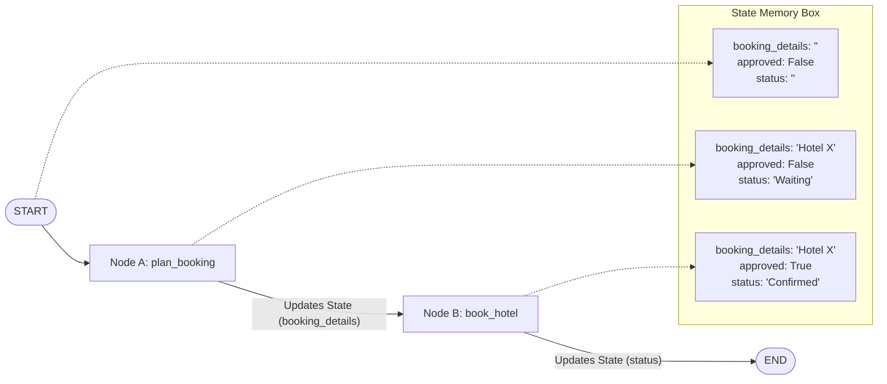
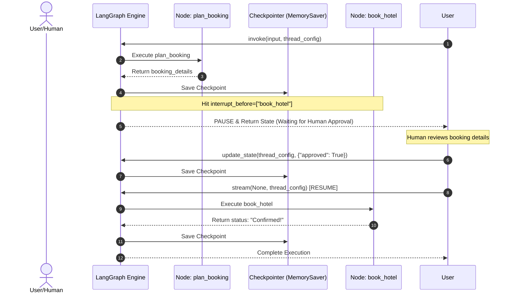
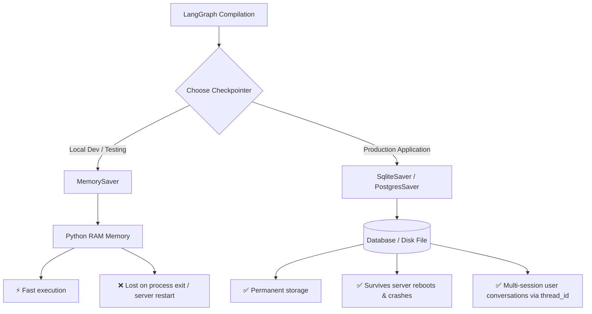
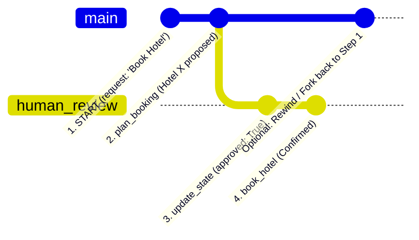

# 🧠 LangGraph Core Concepts: State, Checkpointer & Persistence

A comprehensive guide explaining **State**, **Checkpointers**, and **Persistence** in LangGraph with plain English explanations, code examples, and visual diagrams.

---

## 🧭 Quick Summary & Analogy

| Concept | Video Game Analogy | Real-World Analogy | LangGraph Definition |
| :--- | :--- | :--- | :--- |
| **State** | Player HP, Inventory & Score | Restaurant Order Notepad | The data structure (`TypedDict`) passed between nodes storing current graph memory. |
| **Checkpointer** | Auto-Save Camera Engine | Order Logbook | The engine (`MemorySaver`, `SqliteSaver`) that takes snapshots of state at steps & interrupts. |
| **Persistence** | Saved Game File on SSD | Storing Logbook in a Safe | Preserving state history in RAM or a Database across sessions using a `thread_id`. |

---

## 1. 📋 State in LangGraph

### What is State?
State is the **central shared memory** of your graph. Every node in LangGraph receives the current state, performs logic, and returns updates to the state.

### Visual Workflow


### Code Example
```python
from typing import TypedDict

# 1. Define the State schema
class BookingState(TypedDict):
    request: str
    booking_details: str
    approved: bool
    status: str

# 2. Nodes receive State and return State updates
def plan_booking(state: BookingState):
    return {
        "booking_details": "Hotel X in Chennai for ₹5,000",
        "status": "Waiting for Approval"
    }
```

---

## 2. 📸 Checkpointers & Interrupts

> [!IMPORTANT]
> **Checkpointer** = The camera engine (e.g., `MemorySaver()`).  
> **Checkpoint** = An individual snapshot photo taken by the camera.  
> **`interrupt_before`** = The signal telling the camera to pause execution and snap a photo.

### Human-in-the-Loop Sequence Diagram



---

## 3. 💾 Persistence (In-Memory vs. Database)

Persistence dictates **where checkpoints are stored** and **how long they live**.



### Comparison Matrix

| Feature | `MemorySaver()` (In-Memory) | `SqliteSaver` / `PostgresSaver` (Durable) |
| :--- | :--- | :--- |
| **Storage Location** | Temporary RAM | SQLite file / PostgreSQL DB |
| **Survives Node Interrupts?** | ✅ Yes | ✅ Yes |
| **Survives Script Exit / Reboot?**| ❌ No (Wiped on process exit) | ✅ **Yes (Durable Persistence)** |
| **Use Case** | Prototyping & Unit Testing | Production Web Apps & Chatbots |

---

## 4. ⏳ Thread IDs & Time Travel (State History)

LangGraph checkpointers track complete state history over time using `thread_id`.



### Code Example: Rewinding & Viewing History
```python
from langgraph.checkpoint.memory import MemorySaver

memory = MemorySaver()
graph = builder.compile(checkpointer=memory, interrupt_before=["book_hotel"])
thread_config = {"configurable": {"thread_id": "user_session_101"}}

# 1. Run until interrupt
graph.invoke(initial_state, config=thread_config)

# 2. View all historical checkpoints for this thread
print("--- Checkpoint History ---")
for state_snapshot in graph.get_state_history(thread_config):
    print(f"Checkpoint ID: {state_snapshot.config['configurable']['checkpoint_id']}")
    print(f"Pending Next Node: {state_snapshot.next}")
    print(f"State Values: {state_snapshot.values}\n")
```

---

> [!TIP]
> **Summary takeaway:**  
> Use **State** to structure your data, **Checkpointers** to capture snapshots before sensitive actions, and **Durable Persistence** (`SqliteSaver` / `PostgresSaver`) to build resilient production agents that remember user sessions forever.
