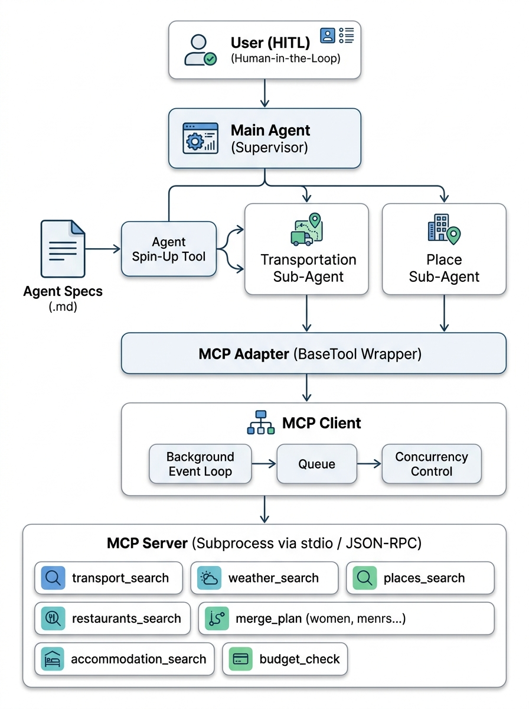

# Agentic Spin-Up Trip Planner

A dynamic, spec-driven re-implementation of the trip planner using **Dynamic Agent Provisioning** and **Model Context Protocol (MCP)**, written in TypeScript.

There is **no hardcoded `StateGraph`**. Instead, agents are instantiated at runtime from Markdown specifications and tool execution is managed via a dedicated MCP architecture.

---

## 🏛️ System Architecture



### Key Architectural Layers

1. **User (HITL) ➔ Main Agent (`travel_agent/mainAgent.ts`)**
   - The Main Agent owns **all interaction** with the user.
   - Human-in-the-Loop (HITL) is exposed as LangChain.js tools (`ask_user`, `choose_transport`, `ask_yes_no`) backed by `travel_agent/hitl.ts`. `choose_transport` shows every transport option with an estimated trip total.
   - After the agent loop, code assembles the plan and re-checks the budget with the place agent when it's over (see [Budget re-check](#-budget-re-check)).
   - Sub-agents are purely research specialists and never interact with the user directly.

2. **Dynamic Agent Provisioning (`travel_agent/spinUp.ts` & `travel_agent/agent_specs/*.md`)**
   - Sub-agents (`transportation_agent`, `place_agent`) are defined declaratively in Markdown files with YAML frontmatter (`name`, `description`, `tools`, `output` schema).
   - The Main Agent launches sub-agents with `launch_subagent`. Each runs in the background with its own session (memory) and status. `wait_for_subagents`, `check_subagent_status`, `send_message_to_subagent` and `stop_subagent` collect results, answer questions, add comments or cancel work (see [`concepts/subagent-lifecycle.md`](concepts/subagent-lifecycle.md)).
   - Each sub-agent's raw tool results are recorded in code, so sub-agents reply only `{"done": true}` and the Main Agent receives a compact summary.

3. **MCP Adapter Layer (`McpTools.langchainTools` in `travel_agent/mcpClient.ts`)**
   - Wraps each discovered MCP tool (using its JSON input schema) as a LangChain.js tool, adding centralized logging and agent labels (e.g. `[Transportation Agent] ✈️ Searching transport...`).

4. **MCP Client (`McpTools` in `travel_agent/mcpClient.ts`)**
   - An async `@modelcontextprotocol/sdk` client over stdio.
   - Limits concurrent tool execution to `MCP_MAX_CONCURRENCY` (default 5).

5. **MCP Server (`travel_agent/mcp_server/server.ts`)**
   - A standalone subprocess built with `McpServer`, communicating over stdio via JSON-RPC 2.0.
   - Exposes 7 domain tools: `transport_search`, `weather_search`, `places_search`, `restaurants_search`, `accommodation_search`, `merge_plan`, and `budget_check`.
   - Runs `merge_plan` and `budget_check` deterministically in code rather than letting LLMs approximate itineraries and budgets.

---

## 💰 Budget re-check

When the assembled plan is over the user's budget:
1. **Code** continues the place agent's session with `budget_feedback` (cap, overage, breakdown, current choices), up to `BUDGET_RETRY_LIMIT` times (default 2). It stops early if an attempt doesn't lower the total.
2. **The place agent** decides where to cut and re-calls its tools with `max_price_per_night` / `max_cost_per_person`.
3. **If it still doesn't fit**, the user can keep the plan, switch to a cheaper transport, or raise the budget.

Details and latency changes: [`concepts/budget-recheck.md`](concepts/budget-recheck.md). Set `TRIP_TIMING=1` to print per-LLM-call, per-tool and per-HTTP timings.

---

## 🚀 Setup

Requires Node 26+.

```bash
cd agentic_spin_up
npm install
cp .env.example .env            # set LLM_MODEL / LLM_API_KEY / LLM_API_BASE (or rely on ../langgraph2/.env)
```

Tool API keys (e.g. `SERP_API_KEY`) fall back to `../langgraph2/.env` when not set here.

---

## 🏃 Run

```bash
npm start -- "Bangalore to Munnar on 2026-10-02 for 3 days, 2 people, adventure and nature, budget 40000"
```

Swapping the LLM provider is a `.env` edit only (`LLM_MODEL`, with `LLM_API_BASE` pointing at your LiteLLM proxy) — no code changes.

---

## 🧪 Test

```bash
npm test            # vitest
npm run typecheck   # tsc --noEmit
```

- `tests/tools.test.ts`: Checks each domain tool against outputs recorded from the original Python implementation (`tests/fixtures/parity.json`), replaying canned HTTP responses.
- `tests/specs.test.ts`: Validates YAML frontmatter and markdown specifications.
- `tests/mcpServer.test.ts`: Tests MCP server startup, tool listing, and parallel tool calls over stdio.
- `tests/smoke.test.ts`: Tests the full happy path with a scripted LLM.
- `tests/budgetRecheck.test.ts`: Tests the budget re-check loop, the ask-user fallback and `choose_transport` offline, with MCP tools run in-process.
- `tests/toolBehaviour.test.ts`: Tests concurrent SerpAPI calls inside tools and the budget limit inputs.
- `tests/subagents.test.ts`: Tests the sub-agent lifecycle: background launch, waiting, sessions, questions, queued comments, stopping and failures.

---

## 🔮 Future Scope

- **Interactive Review & Correction Loop:** Allowing the user to request modifications, swaps, or budget adjustments on the final generated itinerary.
- **Parallel Sub-Agent Execution:** Running `agent_spin_up` sub-agents concurrently.

---

## 🐍 Original Python Implementation

The original Python version this was ported from still lives in [`travel_agent_python/`](travel_agent_python/), self-contained with its own `.venv`, `requirements.txt` and tests.

```bash
# from agentic_spin_up/
travel_agent_python/.venv/bin/python -m travel_agent_python "Bangalore to Munnar on 2026-10-02 for 3 days, 2 people, adventure and nature, budget 40000"
travel_agent_python/.venv/bin/python -m pytest travel_agent_python/tests
```

It shares this project's root `.env` for LLM/tool credentials.
