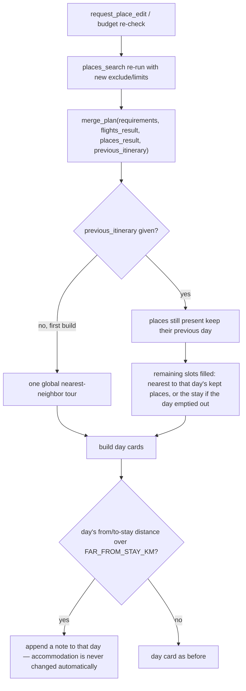

# Itinerary layout: stable re-clustering, proximity-aware meals, far-from-stay notes

`tools/itinerary.ts`'s `buildItinerary` turns a flat list of places, restaurants and one accommodation into a
day-by-day plan. This page covers three decisions: how an edit avoids reshuffling days it didn't touch, how a
meal is picked among equally-good options, and what happens when a day ends up far from the stay.

## The base algorithm (unchanged): one nearest-neighbor tour

With no prior plan to build from, `clusterPlaces` does what it always did: start at the accommodation's
coordinates, repeatedly walk to whichever remaining place is closest, then slice that single ordered tour into
`numDays` day buckets (2–4 places each; rainy days get indoor places pulled to the front). This is still exactly
what runs on the very first build of a trip.

## Stable re-clustering after an edit

Every edit (`request_place_edit`, and each budget re-check attempt) re-runs `places_search` from scratch and gets
back a fresh, re-ranked list — some places gone, some new. Recomputing the whole tour over that new list every
time meant a day the user never asked to change could still be reshuffled, because the tour order shifts as soon
as the underlying set of places changes anywhere.

Instead, `merge_plan` can be given the *previous* itinerary. `buildItinerary` turns its cards into a
`previousLayout` map (place name → the day it was on), and `clusterPlaces` uses it:

- A place still present in the new list **keeps its previous day**.
- Only the delta — places that vanished, and newly-ranked replacements — gets placed, by `clusterByPreviousLayout`:
  each fresh place goes to whichever day is under capacity, nearest to that day's own remaining places, or to the
  **accommodation** if the day lost every one of its places.

This is why a replacement naturally lands near its neighbours — or near the stay, if it's replacing a day's first
or last stop — without any hardcoded distance rule: it's a direct consequence of anchoring the same style of
nearest-neighbor search locally (to a day) instead of globally (to the whole trip).

`previousItinerary` is threaded through `mainAgent.ts`'s `assemble()` from the three places that already have one
in scope: `buildPlan` (`state.previousItinerary`, the last plan shown), `recheckBudget` (`current.itinerary`), and
`resolveOverBudget`'s raise-budget branch (`plan.itinerary`). It's passed as `previous_itinerary` only when
non-null — an MCP tool call with the key present but `undefined` fails schema validation, so it's omitted rather
than sent as `undefined`.

## Meal placement: proximity breaks ties, it doesn't override priority

`buildDayCards` already picks a meal by priority — prefer an option unused anywhere in the trip, then unused so
far, then unused today. That priority is untouched. What changed: **within** whichever tier actually has a match,
the option nearest to that day's own place centroid wins, instead of the first one in the list. Coordinates for
this already exist on every place and restaurant candidate, so this costs nothing extra to compute
(`haversineKm`, already used everywhere else in this file).

## Far-from-stay days: surfaced, never auto-fixed

If a day's distance from the stay to its first stop, or its last stop back to the stay, exceeds
`FAR_FROM_STAY_KM` (default 25, `.env`), a sentence is appended to that day's `note`. Nothing else about the day
changes — no place is moved, and **accommodation is never changed by this code**.

This is deliberate. This app already has an established pattern for consequential decisions — going over budget,
or every transport option being too expensive — surface a choice and let the user decide
(`resolveOverBudget`, `resolveTransportBudgetConflict`); nothing auto-applies a decision like that silently.
Swapping lodging because an edit's replacement happened to land far away is exactly that kind of decision, so it
gets the same treatment: a visible note, not a silent fix.
