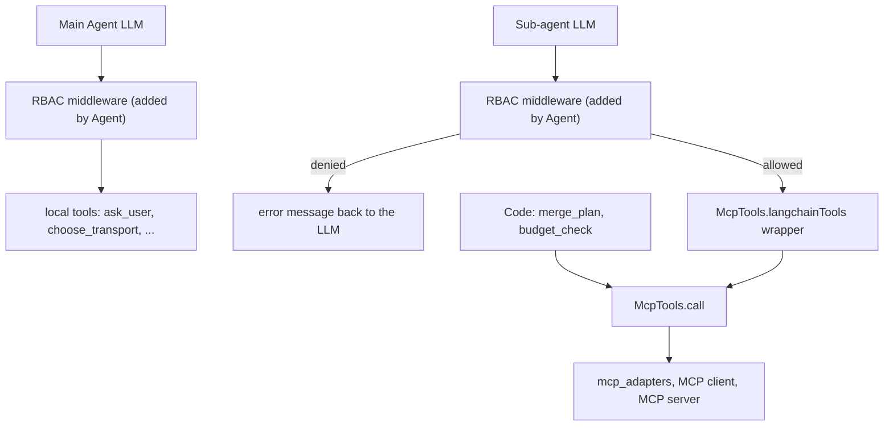
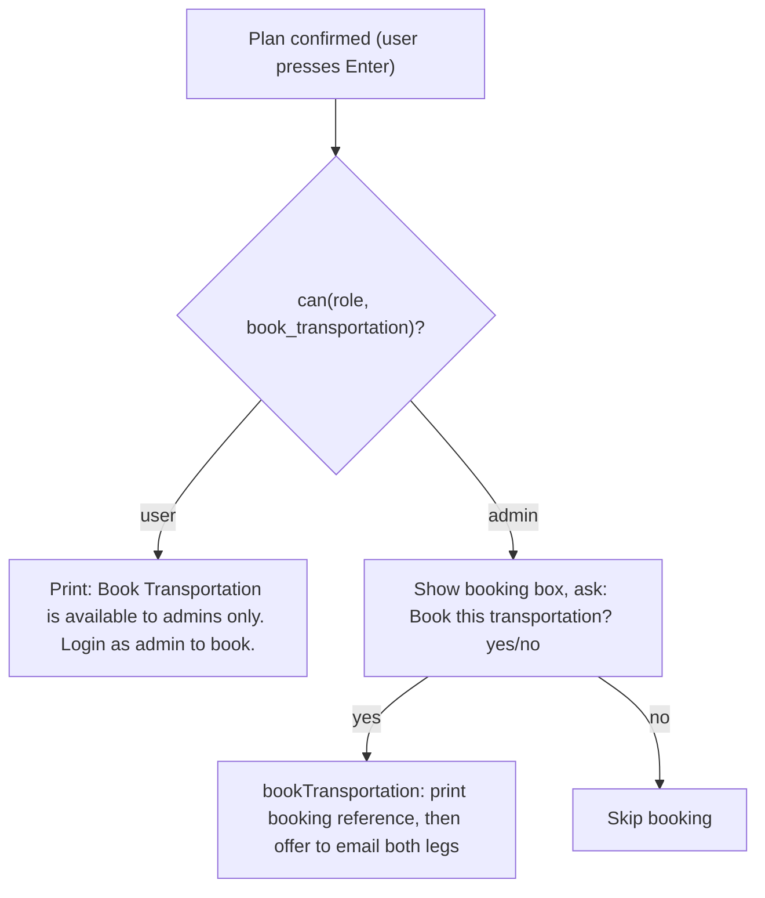

# Role-Based Access Control (RBAC)

RBAC decides which tools a role may call. There are two roles: `user` and `admin`.
`admin` gets everything `user` gets, plus `book_transportation`.

## The check is plain code, not an LLM

The check is a lookup in `travel_agent/rbac.ts`: `can(principal, toolName)` asks whether
the role's list contains the tool. Anything not listed is denied. The role comes from the
CLI (`--admin`, `--role=admin`, or the `ROLE` env var), so the model cannot change it. The
model only sees a "Permission denied" message and can explain it to the user.

The role is self-declared, not authenticated. Treat RBAC as a guardrail, not a security boundary.

## Where the check runs

The RBAC middleware (`travel_agent/rbacMiddleware.ts`) runs on every tool call an agent's
LLM makes, after the LLM picks a tool and before the tool runs. The `Agent` wrapper
(`travel_agent/agent.ts`) adds it to every agent it builds and requires a `principal`, so the
Main Agent and every sub-agent are covered and nobody can forget to attach it. No LLM-callable tool is
privileged today, so the middleware currently acts as default-deny for unlisted tools, a safety net for
any future privileged tool. `SpinUp` passes the
principal on to each sub-agent it launches.

## What is deliberately not checked

Calls the code itself makes, such as `mcp.call("merge_plan")` and `mcp.call("budget_check")`,
skip the middleware. They are fixed steps, not an LLM's choice, so a role check does not belong on them.

## Booking flow (admin only, code-triggered)

`book_transportation` is not an LLM tool. After the user confirms the final plan, `offerBooking`
(`travel_agent/mainAgent.ts`) runs as plain code. It checks `can(principal, "book_transportation")` first,
because hiding an option is a display decision the middleware cannot make.

Why code and not the LLM: booking has no judgement in it (the details are fixed in the confirmed
plan), and when the model decided it, it booked before the plan existed and the approval prompt
appeared before the role check. Non-admins now never see a booking prompt.

`bookTransportation` (`travel_agent/tools/booking.ts`) calls `can` again on its own, so a non-admin is
refused even if `offerBooking` were changed. That is the enforcement; the check in `offerBooking`
only decides what to show.

After a successful booking, the same code asks for an email address and sends the confirmation for both legs; see
`booking-email.md`.

## Adding a tool

The middleware denies by default. A new tool must be added to `USER_PERMISSIONS` in `rbac.ts`
(or to the admin extras) before any agent can call it. A test checks that every tool named in
`agent_specs/*.md` is allowed for `user`.
