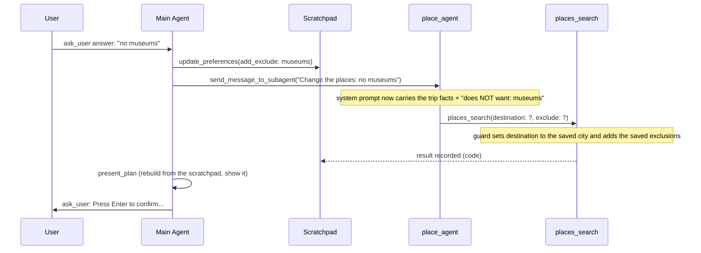

# Shared Scratchpad

One place where every agent in a trip can read the same facts, and where research results are kept.
Each agent still has its **own memory** (its conversation). The scratchpad only holds what they must agree on.

## The problem it solves

After the plan was shown, an edit such as "remove temples" made the place agent search again — and sometimes for a
**different city**. Five things combined to cause it:

1. `place_agent.md` had no rule for an edit message, so the agent fell back to "on a follow-up turn, run all 3 tools".
2. The edit message was only free text. The agent had to remember the destination from the first message, many turns back.
3. `places_search` had no way to say "leave X out". Interests go straight into the search text
   (`"${term} spots attractions in ${destination}"`), so "no temples" as an interest searched *for* temples.
4. "Never switch destination" was only a sentence in a prompt. No code checked it.
5. The trip facts lived in four places (Main Agent chat, `place.task`, the `chosen` object, the place agent's chat),
   with no single source of truth.

## The idea, in plain words

Think of an office. Every person keeps a **notebook** (their own conversation memory). There is also one **whiteboard**
everyone can read. The whiteboard has three sections, and each section has one allowed writer:

| Section | What is on it | Who writes | Why only them |
|---|---|---|---|
| `requirements` | source, destination, start date, days, travellers, interests, budget | the Main Agent's intake code, once every field has passed the shared schema's checks | It talks to the user, so it is the only one that knows what the user said. |
| `preferences` | things to leave out (`exclude`), indoor mode | the Main Agent's intake code (from the user's first message or the exclusions question) and, later, `update_preferences` / `set_indoor_mode` | Deciding that "no temples" is a lasting preference is a judgment call — that stays with the LLM, whether stated up front or added later. |
| `results` | the latest output of each tool, with the arguments used | **code only**, from the tool-result hook | If agents could write here, a wrong city or an invented venue could land on the shared board. |

Sub-agents can read the facts but write nothing to the scratchpad.

```
   User
    |  request
    v
   Main Agent  --extract_requirements-->  (LLM extracts what it can)
    |
    |  intake code asks what's still missing, checks each
    |  answer, then saves requirements + preferences directly
    v
   Scratchpad [requirements . preferences . results]
    |
    |  facts added to the system prompt on every model call
    v
   place_agent / transportation_agent
    |
    |  tool call
    v
   guard (put back destination, dates, exclusions)
    |
    v
   MCP tools --result + arguments, written by code--> Scratchpad
                                                          |
                                                          |  reads
                                                          v
   Main Agent -----------------------------------> present_plan
                                                          |
                                                          v
                                          ask_user: "Press Enter to confirm..."
                                                 |                  |
                                          change |                  | Enter
                                                 v                  v
                                            Main Agent          offerBooking
```

## How a plan edit works now



## Decisions and why

**Facts go into the system prompt, not into each message.** A hook (`dynamicSystemPromptMiddleware` in `agent.ts`)
appends the current facts on every model call. So the agent cannot forget them, the block is always the current
value, the conversation history does not grow with copies of it, and the messages between agents stay exactly what
the Main Agent wrote.

**The guard replaces a wrong value; it does not reject the call.** Before a sub-agent tool call goes out,
`Scratchpad.pin` overwrites `destination`, `start_date`, `num_days` and `travellers` with the saved values (only on the
tools that take them) and adds the saved exclusions to place and restaurant searches. It logs a
`[guard] …` line whenever it changed something. Rejecting would send the model into retry loops; a fact the user
already gave is not something the model should be re-deciding. `transport_search` is deliberately **not** pinned:
a new date or route there is the user's own request ("change transportation").

For the destination, "the same place" is judged by the words, not the exact text: `Chennai`, ` CHENNAI ` and
`Chennai, Tamil Nadu` all count as the saved `chennai`, so they are kept and nothing is logged. Only a name that
really differs (`Madras`, `Ooty`) is replaced. It cannot know that Madras is Chennai; resolving aliases would need
geocoding and is not attempted.

**The model is told when a value was replaced.** `pin` returns the corrected arguments and a `notice`. The tool
wrapper in `McpTools.langchainTools` adds it to what the model sees as `guard_notice` ("the search used the saved
values instead: destination 'Madras' → 'chennai'. Do not try other names"), but records the result without it. Without
this the agent believed it had searched the alias it passed and got nothing, and kept trying more aliases.

**Results are stored with the arguments that produced them.** `onToolResult` now receives the call's arguments, so
the scratchpad can show what each result was actually searched with. Because the guard already fixes the arguments,
the code does not separately compare stored arguments to the requirements.

**Validation is one shared schema, not a tool's own check.** `TripRequirementsSchema` validates the LLM's own
`extract_requirements` call (as `ExtractedRequirementsSchema`, its fields made optional without their defaults),
each typed answer the intake loop collects (`parseAndValidateField`, reusing the same per-field rule), and the
final `scratchpad.setRequirements(...)` call. A missing field or a past date is caught wherever it first shows
up, with the same message every time. See `concepts/architecture/requirements-gathering.md`.

**A plain in-memory object, not LangGraph state or a `Store`.**
LangGraph graph state belongs to one agent's thread, so separate agents cannot share it. A LangGraph `Store` can be
shared, but its extras (saving to disk, per-user memory) are not needed for one trip in one process. The scratchpad
keeps a narrow `get`/`set`-style API so it can become a `Store` later.

**The confirm loop belongs to the Main Agent.** The prompt "Press Enter to confirm. Or ask a question, request a
change to the plan, or ask to recheck the budget:" is now asked by the Main Agent through the existing `ask_user`
tool (same readline channel, empty answer = approved). Two facts about the old design made this cleaner:
the Main Agent already owns all user interaction (per `CLAUDE.md`), and the old loop had code translating the
model's JSON (`edit_plan`, `recheck_budget`) back into calls. The Main Agent now calls the tools itself:
`update_preferences`, `send_message_to_subagent`, `wait_for_subagents`, and the new `present_plan`.

`present_plan({ recheck_budget? })` is a thin wrapper over the existing `buildPlan`, `fitPlanToBudget` and
`showPlan` — the only reason it is a tool is that an agent cannot call a plain function. It also counts rounds and
returns `limit_reached` after `MAX_PLAN_REVISION_TURNS` (5 revisions), which replaces the old loop cap.

**Two code-side safety nets stay.** After the Main Agent stops, `planTrip` (a) sends it back if a step was skipped
(`unfinishedSteps`: launch, `choose_transport`, `present_plan`), and (b) shows the plan itself if none was shown, or
if new research was recorded after the last one — so the user never confirms a stale plan.

**`exclude` filters candidates before the cap.** In `searchPlaces` and `searchRestaurants`, matching candidates are
dropped **before** dedupe and the pool size cap, so the pool refills from what is left instead of shrinking. Matching
is by name, category and types (snake_case such as `hindu_temple` counts), and a plural term also matches its
singular. It is a filter, not a search instruction, so it works even if the search text returns temples anyway.

**The transport-total cache knows about new research.** `choose_transport` stores the scratchpad `version` with the
cached preview; `buildPlan` reuses it only if no result has been recorded since. This replaced the old
`chosen.cache = null` reset in the edit branch.

## Before and after

| | Before | After |
|---|---|---|
| Where facts live | Main Agent chat, `SubagentTask.task`, `chosen`, place-agent chat | One `Scratchpad` per trip (`travel_agent/scratchpad.ts`) |
| Requirements | Emitted in the Main Agent's final JSON; code rebuilt them from sub-agent tasks (`requirementsFromTasks`) | Gathered in one LLM call: `extract_requirements` extracts what it can from free text; code asks whatever's left one field at a time with fixed templates, checks each answer against `TripRequirementsSchema`, then saves directly and tells the Main Agent to continue. See `concepts/architecture/requirements-gathering.md`. |
| Preferences | Indoor mode in `chosen`; exclusions had no home | `preferences` section |
| Tool results | `record.tools` per sub-agent task, read with `spin.latest(X).tools` | `results` section keyed by tool name; `SubagentTask` keeps only `toolNames` |
| Tool-result hook | `onResult(tool, result)` | `onResult(tool, result, input)`; plus an optional `guard(tool, input)` in `McpTools.langchainTools` |
| Message to a sub-agent | Whatever the Main Agent wrote | Unchanged; the facts arrive through the system prompt |
| Wrong destination in a tool call | Nothing stopped it | Guard puts the saved value back and logs it |
| Excluding something | Not possible | `exclude` argument on `places_search` / `restaurants_search` |
| Edit rules in `place_agent.md` | None | "User edit" section; the "follow-up turn = run all 3 tools" line now applies only once the weather is settled |
| Confirm prompt | `planTrip` loop, JSON `plan_feedback` → `edit_plan` / `recheck_budget` / `answer` | Main Agent → `present_plan` → `ask_user`; ends with `{"confirmed": true}` |
| Raising the budget after a plan | Reverted by the next rebuild | Saved into `requirements`, so later rebuilds keep it |

## Where the code is

- `travel_agent/scratchpad.ts` — the store, `factsBlock()`, `pin()`.
- `travel_agent/mcpClient.ts` — `ToolResultHandler` with arguments, `ToolGuard`.
- `travel_agent/agent.ts` — `guard` and `facts` options; the facts hook.
- `travel_agent/spinUp.ts` — takes the scratchpad, wires the hook, guard and facts for each sub-agent.
- `travel_agent/mainAgent.ts` — the intake save/send block, `update_preferences`, `present_plan`, the STEP 4 prompt, `PlanState`.
- `travel_agent/mcp_server/handlers.ts`, `travel_agent/tools/maps.ts` — `exclude`.
- `travel_agent/agent_specs/place_agent.md` — trip facts and "User edit".

## Tests

- `tests/scratchpad.test.ts` — the store and every rule of the guard, including spelling variants and the notice.
- `tests/toolNotices.test.ts` — the guard notice and a search problem reach the model, and are left out of the recorded result.
- `tests/toolBehaviour.test.ts` — `exclude` on places and restaurants.
- `tests/planEdit.test.ts` — an edit end to end: a place agent that drifts to another city still searches the saved
  one with the exclusion applied; the plan is shown again; the two safety nets; the revision cap.
- `tests/requirementsGathering.test.ts` — an incomplete or past-dated requirement is rejected with an error naming the field.

## Known limits

- Saving requirements again with a **different destination** updates the facts, but does not restart research on its
  own; the Main Agent would have to launch the sub-agents again. The prompt does not spell this out yet.
- `indoor_mode` is kept in `preferences` but left out of the facts block on purpose, so it cannot look like an answer
  to the weather question before the user has decided.
- The guard cannot tell that two different names are one place (Madras and Chennai); it only recognises spelling,
  case and qualified forms of the saved name.
