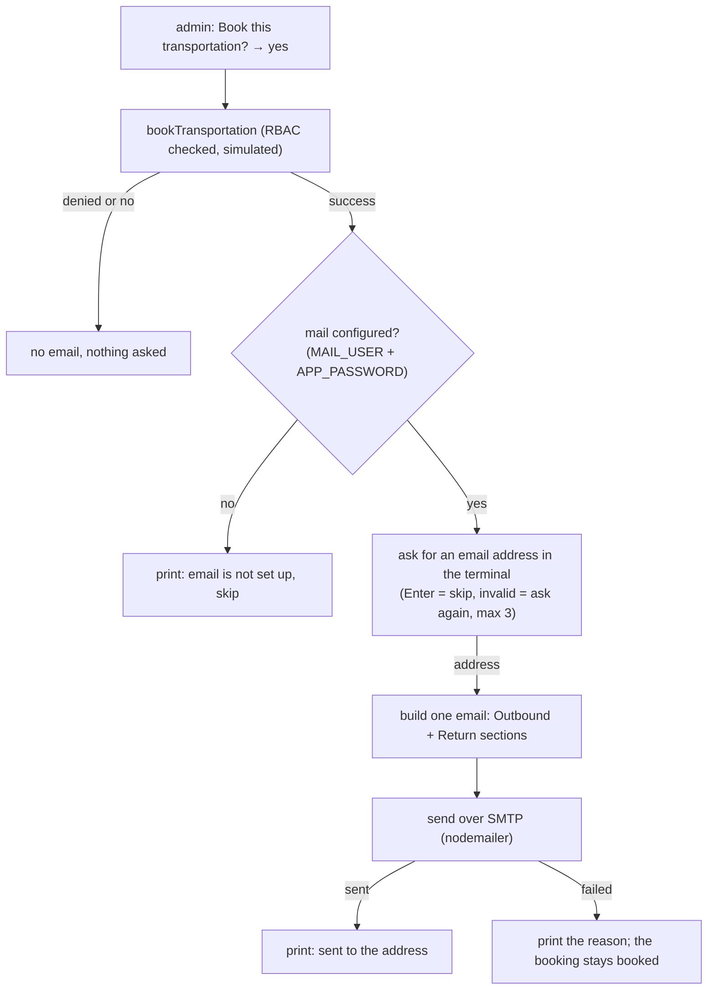

# Booking confirmation email

When an admin books, the traveller gets an email with the booking details for **both legs** of the trip.

## What the user sees

1. The admin says yes to "Book this transportation?".
2. If the booking succeeds, the terminal asks: `Booking confirmed (TRANSPORT-BK-…). Email the details to (press Enter to skip):`
3. The address is checked. An invalid one is asked again, up to 3 times. Enter skips.
4. One email is sent: one booking reference, an **Outbound** section (source → destination, on the start date) and a
   **Return** section (destination → source, on the return date). Each has the option, provider, fare per person and
   booking links. A trip with no return leg has the outbound section only.
5. A calendar file is attached to the same email — see "Calendar file (.ics)" below.

The booking itself is simulated (`bookTransportation` makes up a reference and books nothing with any operator). So the
email is a **booking confirmation and trip summary, not an e-ticket**, and its footer says so. Real tickets need the
fare/booking API that is not implemented yet.

## Why it is built this way

- **The terminal asks, not an agent.** The address goes through `Hitl`, like every other prompt. It is never saved in the
  scratchpad, so it never reaches a model prompt (the scratchpad's trip facts are pasted into every sub-agent's prompt).
- **Code sends, not a tool.** Only `offerBooking` sends mail, after the admin's own "yes". It is not an MCP tool, so no agent
  can email anyone. It needs the same permission as booking (`book_transportation`, admin only).
- **One booking, one list of legs.** `bookedLegs(plan)` in `mainAgent.ts` builds the legs once. The booking box, the booking
  record (`details.legs`) and the email all read that list. Each leg's text (`describeLeg`, `tools/booking.ts`) is shared
  by the email body and the calendar file, so the two can never disagree.
- **A failed email never undoes the booking.** The reason is printed (never the password) and the result carries
  `email: { sent: false, reason, error }`. `reason` is `not_configured`, `skipped` or `send_failed`.
- **Content is safe.** The subject and body come from a fixed template. Values that came from search results are
  HTML-escaped, and only `http(s)` links are made clickable. The address is validated, so it cannot carry extra headers.

## Calendar file (.ics)

Every confirmation email carries a `trip-<reference>.ics` attachment (`tools/ics.ts`), so the traveller's own mail or
calendar app can add the trip with one click — no new setting, no new prompt: it rides on the email that is already
being sent.

- **One all-day event**, from the trip's start date through its last day, marked **busy** (`TRANSP:OPAQUE` — an
  all-day event is "free" by default). No departure times: fares carry a duration, not a clock time.
- **`METHOD:PUBLISH`**, not an invite. It's a plain event to import, not a meeting the recipient has to accept or
  decline — there's no organiser/attendee relationship here.
- **Escaped and folded per RFC 5545**, so it opens cleanly in real calendar apps: commas, semicolons, backslashes and
  newlines are escaped in text fields, and long lines are folded at 75 octets without ever splitting a multi-byte
  character (₹, →, ⇄) in half.
- **`UID`** is derived from the booking reference, so importing the same file twice never creates two different
  events.

## Settings (`.env`, see `.env.example`)

| Variable | Meaning | Default |
|---|---|---|
| `MAIL_USER` | The account the app password was made for (also the sender) | none: email is off |
| `APP_PASSWORD` | The app password. Spaces are removed (Google shows it in groups) | none: email is off |
| `MAIL_HOST` | SMTP server | `smtp.gmail.com` |
| `MAIL_PORT` | Port. 465 uses TLS from the start; any other port uses STARTTLS | `465` |
| `MAIL_FROM` | The "from" address | `MAIL_USER` |

Another SMTP provider is a `.env` edit only. Gmail needs 2-step verification on the account before it offers app passwords.

## Tests

No test sends mail. `vitest.config.ts` blanks `MAIL_USER` and `APP_PASSWORD`, which wins over a real `.env`, and the mail
tests mock `nodemailer`. To try it for real, run `npm start -- --admin "<trip>"`, book, and type your own address.
