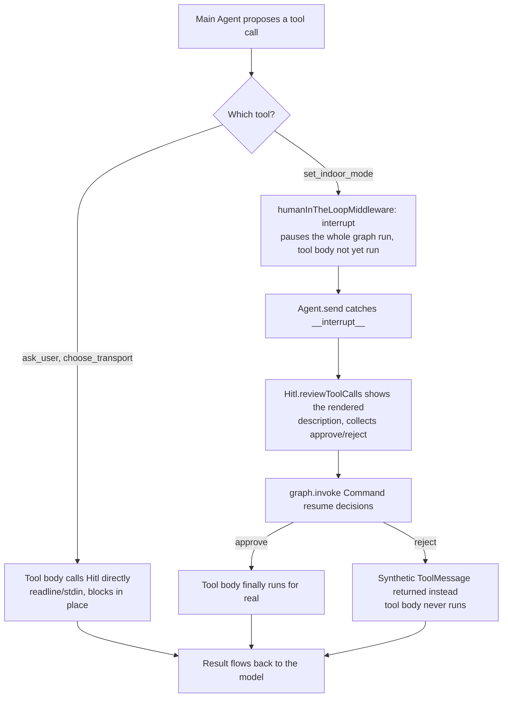

# Human-in-the-Loop (HITL) Middleware & Architecture

In the Agentic Trip Planner, **Human-in-the-Loop (HITL)** is the architectural bridge between autonomous AI decision-making and human oversight. There are two distinct mechanisms in play, chosen per tool based on what kind of human interaction that tool actually needs — not one uniform mechanism applied everywhere.

---

## 1. Two mechanisms, not one

**Plain synchronous `Hitl` calls** — a tool's own body calls a method on the `Hitl` channel (`travel_agent/hitl.ts`), which does real `readline`/stdin I/O and blocks until the user answers. No pausing of the LangGraph run is involved; the tool simply hasn't returned yet.

**LangGraph's interrupt/resume protocol**, via `humanInTheLoopMiddleware` — the middleware intercepts a proposed tool call *before it executes*, calls LangGraph's `interrupt(...)`, and the entire graph run pauses. The tool's own body never runs during this pause. Resuming requires the caller to invoke the graph again with `new Command({ resume })`, carrying an approve/edit/reject decision. This is built for pausing across a process/actor boundary (e.g. a different reviewer, possibly much later) — the decision vocabulary is specifically "should this one proposed action run, as-is or edited, or not at all?"

### Why the split

An earlier iteration of this project put all four human-facing tools (`ask_user`, `choose_transport`, `set_indoor_mode`, `book_flight`) under `interruptOn`, but never implemented the resume half of the protocol (no code anywhere called `Command({resume})`). Every interrupt pausing forever, `Agent.send` had no way to answer it, and the Main Agent looked like it had stopped extracting information from the user at all — every gated tool call just hung.

The fix wasn't to build resume plumbing for all four uniformly — it was to ask, per tool, *what kind of human interaction does this actually need?*

- **`ask_user`** — pure data collection ("what's the value of X?"). Used for iterative requirement gathering (STEP 1, one field at a time), relaying sub-agent doubts, asking for a raised budget figure, and the plan confirm prompt (STEP 4: an empty answer means approved — see [scratchpad.md](scratchpad.md)). There's no proposed *action* to approve; the answer *is* the payload. The interrupt protocol's approve/edit/reject vocabulary has no slot for "here's arbitrary data" (the closest fit, `reject` with a `message`, frames every normal answer as a tool *error*, which is a workaround, not a fit).
- **`choose_transport`** — picking one of several computed options. The interrupt fires *before* the tool runs, but the list of labeled options (with budget-adjusted totals) doesn't exist until the tool body actually executes several MCP calls. There's nothing to show the user at interrupt time. (A custom `wrapToolCall` middleware — which runs the real tool first, then interrupts with the real result — could make this fit properly; that's a separate, not-yet-built change, tracked apart from the two tools below.)
- **`set_indoor_mode`** — a single yes/no on one proposed action ("switch to indoor because of this forecast?"), with no data the tool needs to compute first. Genuine fit for `interruptOn`.
- **`book_transportation`** (then named `book_flight`) — was once registered here too, but is no longer an LLM tool. It was consequential and admin-gated with fixed arguments, yet the model decided *when* to call it, and the approval pause fired before the role check, so a non-admin was asked to approve something they could never do. Booking is now a code-triggered step after the plan is confirmed (`offerBooking` in `mainAgent.ts`): code checks the role, shows the booking box, and asks a plain yes/no through `Hitl.askYesNo`. See [rbac.md](rbac.md).

So `ask_user`, `choose_transport` and the booking yes/no stay plain, ungated `Hitl` calls. `set_indoor_mode` is the only tool registered under `interruptOn`, and the only one where the interrupt/resume cycle is completed end-to-end.



---

## 2. The resume loop (`travel_agent/agent.ts`)

`Agent.send()` is where the interrupt/resume cycle is actually closed. Only the Main Agent supplies a `resolveInterrupt` callback (sub-agents never register `interruptOn`, so they never hit this path):

```typescript
async send(message: string, signal?: AbortSignal): Promise<Dict> {
  const config = { configurable: { thread_id: this.sessionId }, signal, recursionLimit: settings.llmRecursionLimit };
  let response: any = await this.graph.invoke({ messages: [{ role: "user", content: message }] }, config);
  while (response.__interrupt__?.length) {
    if (!this.resolveInterrupt) throw new Error(`Unhandled interrupt on session '${this.sessionId}'`);
    const resume = await this.resolveInterrupt(response.__interrupt__[0].value as HITLRequest);
    response = await this.graph.invoke(new Command({ resume }), config);
  }
  const text = lastMessageText(response);
  // ...parse JSON, fall back to { notes: text }
}
```

Looping (rather than resuming once) matters because resuming can itself land on another interrupt within the same turn. This confines all the new complexity to `Agent` — `MainAgentSession` and everything in `planTrip` (including the requirements-gathering and STEP-2-completion guardrails) still just call `session.send()` and get back a final `Dict`, unaware that a pause/resume cycle happened underneath.

`Hitl.reviewToolCalls` (`travel_agent/hitl.ts`) is what `resolveInterrupt` delegates to — it renders each paused action's `description` (built from the pure `formatWeatherBox` string builder, so there's no I/O baked into the description itself; `formatBookingBox` is the same kind of builder, now printed directly by `offerBooking`) and collects an approve/reject decision per action, serialized through the same FIFO queue every other `Hitl` prompt uses.

---

## 3. Interaction Model & Policy Matrix

| Tool | Mechanism | Allowed Decisions | Why |
|---|---|---|---|
| `ask_user` | Plain `Hitl.handleSubagentClarification` (readline) | n/a | Free-text data collection — no action to approve |
| `choose_transport` | Plain `Hitl.handleTransportChoice` (readline) | n/a | Options don't exist until the tool runs; interrupt-before-execution can't show them |
| `set_indoor_mode` | `humanInTheLoopMiddleware` interrupt/resume | `["approve", "reject"]` | Single yes/no on one proposed action, no precomputed data needed |
| booking (`offerBooking`, not a tool) | Code-triggered `Hitl.askYesNo` after the plan | n/a | Fixed action with known arguments; role check must decide what to show, so it lives in code |

For `set_indoor_mode`, the tool body itself only runs *after* approval — it no longer does its own prompting. `setIndoorMode`'s body just reports the outcome (`{ approved: true, indoor_mode: enabled ?? true }`).

RBAC (see [rbac.md](rbac.md)) is a separate control from approval: it restricts *who* may book at all, while the yes/no governs *whether that specific booking proceeds*.

---

## 4. Rich Weather Forecast UI Display

`formatWeatherBox` (a pure function, no I/O) builds the same rendered forecast card as before, now used as the interrupt's `description` so it's shown to the user before they decide:

```
┌ Weather Forecast Notice ──────────────────────────────────────────
│ Destination : Munnar
│ Summary     : 2 of 3 days with high rain probability
├ Daily Breakdown:
│   • 2026-10-02 : Moderate rain · 15.0°C – 22.0°C · 65% rain [⚠️ BAD WEATHER]
│   • 2026-10-03 : Heavy rain    · 14.0°C – 21.0°C · 80% rain [⚠️ BAD WEATHER]
│   • 2026-10-04 : Partly cloudy · 17.0°C – 24.0°C · 10% rain
└───────────────────────────────────────────────────────────────────

Approve set_indoor_mode? (yes/no)
>
```

---

## 5. Serialized I/O & Parallel Safety (`travel_agent/hitl.ts`)

When sub-agents or tool calls run concurrently, uncoordinated terminal prompts would garble stdout and stdin. The `Hitl` class ensures strict FIFO serialization via `queue` — this applies equally to plain prompts (`ask_user`, `choose_transport`) and to `reviewToolCalls`:

```typescript
export class Hitl {
  private queue: Promise<unknown> = Promise.resolve();

  private serial<T>(fn: () => Promise<T>): Promise<T> {
    const run = this.queue.then(fn);
    this.queue = run.catch(() => undefined);
    return run;
  }
}
```

---

## 6. Automated Test Support

For unit and integration testing without interactive humans, `Hitl` accepts a scripted list of answers — this covers both plain prompts and `reviewToolCalls`' approve/reject questions, since both read through the same `input()` method:

```typescript
const hitl = new Hitl(["yes", "1"]); // answers a yes/no gate with 'yes', a choice list with '1'
const result = await planTrip("Plan 3 days in Munnar for 2", { hitl });
```
