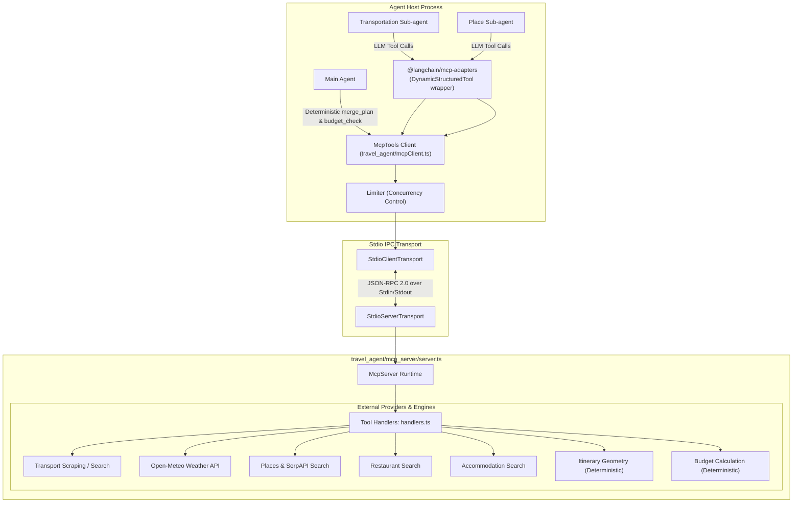

# Model Context Protocol (MCP) Architecture

The **Model Context Protocol (MCP)** is an open standard designed to securely and uniformly connect Large Language Models (LLMs) and autonomous agents to external tools, data sources, and computational engines.

In the Agentic Trip Planner, MCP provides a decoupled, process-isolated boundary between the agent orchestration layer (LangChain / LangGraph) and the actual tool implementations (transport scrapers, weather APIs, place searchers, itinerary calculators, and budget checkers).

---

## 1. Why MCP Instead of Traditional Ad-Hoc APIs?

In traditional agent systems, tools are often implemented as direct in-process function callbacks or bespoke REST/RPC wrappers. While functional for simple scripts, this approach introduces significant architectural liabilities:

| Dimension | Traditional Ad-Hoc APIs / Direct Functions | Model Context Protocol (MCP) |
|---|---|---|
| **Contract & Discovery** | Ad-hoc schemas, custom serialization, and bespoke parameter mapping per tool. | Standardized JSON-RPC 2.0 protocol with automated schema discovery (`tools/list`) and invocation (`tools/call`). |
| **Process Isolation** | In-process execution: tool crashes, unhandled rejections, or memory leaks risk crashing the host agent runtime. | Out-of-process execution: tools run in a dedicated server process communicating over standard transports (e.g. `stdio`). |
| **Telemetry & Logging** | Uncoordinated `console.log` calls garble CLI outputs and agent reasoning streams. | First-class bi-directional notifications (`logging/message`) routed cleanly to the client session. |
| **Ecosystem Portability** | Custom glue code required for every framework (LangChain, LangGraph, custom agent runtimes, Claude Desktop). | Pluggable, universal standard: any MCP-compliant client can discover and use tools without framework rewrites. |
| **Execution Consistency** | Separate calling conventions for LLM tool calling vs programmatic/code-driven calls. | Unified invocation interface for both LLM-driven sub-agents and deterministic workflow steps. |

---

## 2. MCP System Architecture

The trip planner implements a Client-Server architecture over standard input/output (`stdio`) IPC:



---

## 3. Server Implementation (`travel_agent/mcp_server/`)

The server is built with the `@modelcontextprotocol/sdk` library and runs as an independent child process.

### Server Lifecycle & Stdio Transport (`server.ts`)

```typescript
import { McpServer } from "@modelcontextprotocol/sdk/server/mcp.js";
import { StdioServerTransport } from "@modelcontextprotocol/sdk/server/stdio.js";
import { TOOLS } from "./handlers.ts";

const server = new McpServer({ name: "trip-planner-tools", version: "1.0.0" }, { capabilities: { logging: {} } });

// Telemetry helper to stream server logs back to client
const log = (data: string) => server.sendLoggingMessage({ level: "info", data });

// Register all tool handlers
for (const [name, tool] of Object.entries(TOOLS)) {
  server.registerTool(name, { description: tool.description, inputSchema: tool.inputSchema }, async (args: any) => ({
    content: [{ type: "text" as const, text: JSON.stringify(await tool.run(args, log)) }],
  }));
}

await server.connect(new StdioServerTransport());
```

### TypeScript vs. Python MCP Implementation

In Python MCP implementations, tools are typically registered using function decorators:
```python
# Python MCP SDK pattern
@mcp.tool()
def search_places(destination: str, interests: list[str]) -> dict:
    ...
```

In TypeScript, decorators apply to class methods rather than standalone functions. The TypeScript MCP SDK instead uses functional schema registration via `server.registerTool(name, { description, inputSchema }, handler)` paired with **Zod** schema definitions for type validation and automatic JSON schema derivation.

---

## 4. Exposed MCP Tools Catalog

The MCP server exposes 7 specialized tools spanning real-time data retrieval and deterministic computations:

| Tool Name | Input Schema Summary | Type | Responsibility |
|---|---|---|---|
| `transport_search` | `source`, `destination`, `start_date`, `travellers` | External Search | Researches flight, train, and bus options sorted by price and travel duration. |
| `weather_search` | `destination`, `num_days`, `start_date` | External API | Fetches destination forecast via Open-Meteo and computes `bad_weather` heuristic. |
| `places_search` | `destination`, `interests`, `indoor_only`, `max_cost_per_person` | External API | Discovers top sights and attractions, respecting indoor constraints and budget caps. |
| `restaurants_search` | `destination`, `interests`, `max_cost_per_person` | External API | Finds dining venues categorized by breakfast, lunch, and dinner. |
| `accommodation_search`| `destination`, `travellers`, `start_date`, `nights`, `max_price_per_night` | External API | Finds lodging candidates with verified nightly pricing and budget filtering. |
| `merge_plan` | `requirements`, `flights_result`, `places_result` | Deterministic | Assembles researched transport and destination data into day-by-day itinerary geometry. |
| `budget_check` | `requirements`, `places_result`, `itinerary`, `budget_cap` | Deterministic | Performs rigorous arithmetic verification of total trip expenses against budget limits. |

### Why Deterministic Logic Lives in MCP Tools

`merge_plan` and `budget_check` are pure algorithmic operations that do not query external web APIs. Hosting them as MCP tools provides crucial architectural guarantees:
1. **Zero LLM Hallucination:** Arithmetic, budget totals, currency conversions, and time-slot geometries are computed deterministically. The LLM never "estimates" or invents budget sums.
2. **Zero Token Waste:** Merging large arrays of places, meals, and transport fares into daily schedules costs zero LLM context tokens.
3. **Uniform Invocation:** Code (such as `planTrip` or `choose_transport`) and agents invoke the exact same deterministic operations through the standard MCP interface.

---

## 5. Client-Side Integration (`travel_agent/mcpClient.ts`)

The client wrapper `McpTools` coordinates connection management, tool schema conversion, concurrency limiting, and result caching.

### `@langchain/mcp-adapters` Schema Conversion

`McpTools.open()` connects to the stdio subprocess and uses `@langchain/mcp-adapters` (`loadMcpTools`) to translate MCP JSON schemas into LangChain `DynamicStructuredTool` instances:

```typescript
async open(): Promise<this> {
  this.client.setNotificationHandler(LoggingMessageNotificationSchema, ({ params }) => {
    if (params.data) console.log(`    [MCP Server] ${params.data}`);
  });
  await this.client.connect(this.transport);
  this.tools = await loadMcpTools("trip-planner", this.client, { defaultToolTimeout: this.timeoutMs });
  return this;
}
```

### Agent Tool Filtering & Scoping

The MCP server exposes all available tools globally. However, sub-agents require strict least-privilege scoping:
- `transportation_agent` is scoped strictly to `["transport_search"]`.
- `place_agent` is scoped to `["weather_search", "places_search", "restaurants_search", "accommodation_search"]`.

`McpTools.langchainTools()` filters the loaded tools based on the agent's specification:

```typescript
langchainTools(names: string[] | null = null, agentLabel = "", onResult?: ToolResultHandler) {
  return this.tools
    .filter((t) => names === null || names.includes(t.name))
    .map((t) =>
      tool(
        async (input: Dict) => {
          const prefix = agentLabel ? `  [${agentLabel}] ` : "  ";
          console.log(`${prefix}${TOOL_DESCRIPTIONS[t.name] ?? `Calling ${t.name}`} using ${t.name} tool...`);
          const result = await this.call(t.name, input);
          onResult?.(t.name, result);
          return result;
        },
        { name: t.name, description: t.description, schema: t.schema },
      ),
    );
}
```

### Raw Result Interception (`onResult`)

When a sub-agent executes an MCP tool, the raw response can contain dozens of hotel options or complex attraction metadata. To prevent context window bloat:
1. The `onResult` callback intercepts the raw JSON payload and saves it directly into the sub-agent task record (`SpinUp`).
2. The sub-agent only needs to return a lightweight status summary (`{"done": true, "notes": "Found 5 hotels and top sights"}`) in its message back to the Main Agent.
3. The full raw data remains available in memory for final plan assembly (`buildPlan` / `merge_plan`).

---

## 6. Safe Execution Pipeline & The Adapter Hook Vulnerability

During architectural design, using `@langchain/mcp-adapters`' built-in `beforeToolCall` and `afterToolCall` lifecycle hooks was evaluated for managing concurrency slots and telemetry timers.

### The Failure-Mode Bug

Direct testing against failing MCP tools revealed a critical vulnerability in the adapter's lifecycle hooks:

```
--- calling ok_tool via .invoke() ---
events: [ 'before:ok_tool', 'after:ok_tool' ]

--- calling fail_tool via .invoke() ---
invoke() threw: MCP tool 'fail_tool' returned an error
events: [ 'before:fail_tool' ]          ← afterToolCall NEVER ran!
```

> [!CAUTION]
> **`afterToolCall` does not fire when a tool invocation fails.** If concurrency slot releases (`limiter.release()`) or cleanup handlers are placed inside `afterToolCall`, any tool failure permanently leaks a concurrency slot, rapidly deadlocking the entire agent system.

### Unified `McpTools.call()` Solution

To guarantee safety under all conditions, all MCP invocations (both agent-driven tool calls and programmatic code calls) route through a single unified `call()` method featuring a strict `try/finally` block:

```typescript
call(name: string, args: Dict = {}): Promise<any> {
  const target = this.tools.find((t) => t.name === name);
  if (!target) throw new Error(`Unknown MCP tool '${name}'`);
  return this.limit(async () => {
    const done = startTimer(`mcp ${name}`);
    try {
      const text = await target.invoke(args);
      try {
        return JSON.parse(text);
      } catch {
        return text;
      }
    } finally {
      done(); // Guaranteed timer settlement and limiter slot release
    }
  });
}
```

---

## 7. Telemetry, Concurrency, and Process Lifecycle

1. **Concurrency Limiting:** `createLimiter(settings.mcpMaxConcurrency)` throttles simultaneous tool requests to protect downstream APIs from rate limits and socket exhaustion.
2. **Structured Logging:** Server logging events (`server.sendLoggingMessage`) are routed back through `LoggingMessageNotificationSchema` to provide clear visibility without interfering with stdio transport frames.
3. **Telemetry & Timers:** Every MCP invocation is measured via `startTimer(...)`. When running with `TRIP_TIMING=1`, detailed per-tool execution latencies are exported to stderr.
4. **Clean Process Teardown:** `McpTools.close()` terminates the client connection and closes standard I/O pipes, ensuring child processes are cleanly reaped without orphaned Node instances.

---

## 8. Verification and Testing

MCP integration is verified across multiple testing layers:

- **Stdio Integration Suite (`tests/mcpServer.test.ts`):** Spawns the real MCP server subprocess over stdio, verifying full tool registration, individual tool calls, and high-concurrency parallel executions.
- **In-Process Mocking (`tests/budgetRecheck.test.ts`):** Validates deterministic tool invocation and schema parity in memory for fast offline unit testing.
- **Type Safety:** Verified clean via `npm run typecheck`.