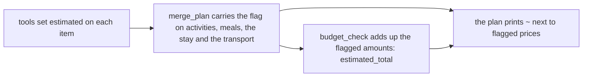
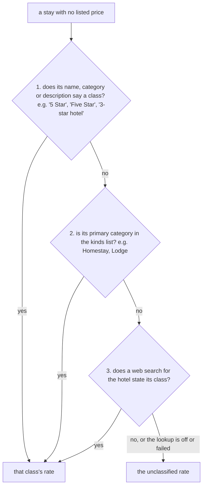
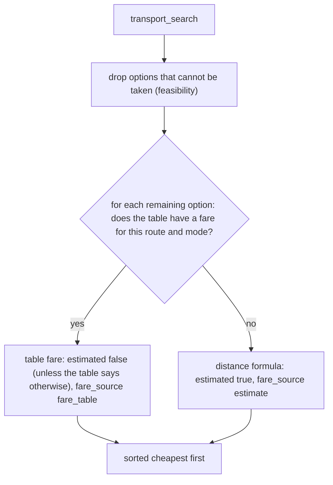

# Price estimates, transport fares and feasibility

Some prices in a plan are real (a listed hotel rate, a fare you entered) and some are guesses (a default
meal cost, a distance formula). Every guess is now flagged `estimated: true` and shown with a `~`, so a
guess never reads as a real quote. This page explains where each flag comes from.

## The `estimated` flag

It is a boolean added at the end of each item the tools return.

| Item | `estimated` is `false` when | `estimated` is `true` when |
|---|---|---|
| Attraction or restaurant (`places_search`, `restaurants_search`) | The listing has a price level (`$$`, `₹200–₹400`) | There is none, so the cost is a default or a keyword guess |
| Stay (`accommodation_search`) | The rate is a real nightly rate (`google_hotels`, or a listed price) | There is no price, so the rate comes from its star class |
| Transport option (`transport_search`) | The fare comes from the route table, and the table does not mark it uncertain | The fare is the distance formula, or the table marks it `estimated` |

Transport options also carry `fare_source`: `"fare_table"` or `"estimate"`.

Serper returns no price fields at all, so with SerpAPI out of quota almost everything is an estimate.

### Where you see it

- The plan prints estimated fares with a `~` (`Transport : Train — ~8h — ~₹450`). Places and restaurants
  already showed `~₹…/pp` when they had no listed price.
- The transport list the user picks from uses the same `~`, and so does the booking confirmation.
- The budget line adds `about ₹X of this is an estimate (shown with ~)` when part of the total is a guess.
- `budget_check` returns `estimated_total` next to `total`. The total itself is unchanged.



## Hotel rates from the star class (`data/hotel_rate_bands.json`)

A stay with no price used to get `3000 + 1500 × (position in the list % 4)`, which depended on the order Google
returned. It now gets a nightly rate for its **star class** (1 to 5 stars), which is what sets a hotel's price tier.

**The guest review score is not used.** A 4.8-rated homestay is still a homestay, and a 3.0-rated 5-star hotel is
still expensive. The score stays in the `rating` field for display only.

**Serper returns no star class.** Its payload has only a generic Google category as `type` ("Hotel", "Resort
hotel", "Homestay", "Cottage", "Lodge", "Inn"). So the class is worked out in this order, stopping at the first
step that answers:



Step 3 is `lookupHotelClass` in `tools/hotelClass.ts`. It is one Serper web search (`/search`, **1 credit**) for
`"<hotel name> <city>"`, and it runs only for a stay that has no listed price and that steps 1 and 2 could not
classify, so it is at most six searches for a trip. Its answers are cached like every other search, so a repeat
run spends nothing. `HOTEL_CLASS_LOOKUP=false` turns it off.

A class is accepted from a search result only if:

- It is **stated as a kind of hotel**: "a Premium five star Luxury Resort", "a luxurious 5-star resort",
  "Classified 5 Star Resort". Snippets are full of guest scores, so a number of stars that is not followed by a
  hotel word ("rated 4 out of 5 stars", "5 star reviews", "a 4.5 star hotel") is ignored.
- The **same result names the hotel** (every distinctive word of its name, leaving out the city and words like
  "Resort"), so a page listing "Top 5 star hotels in Munnar" says nothing about this hotel.
- The first result that qualifies wins.

This is a class the web says, often the hotel's own marketing, and not an official grading.

- The name is read **before** it is cleaned. `cleanName` cuts a title at `|` and ` - `, which is where "Luxury 5 Star
  Resorts" usually sits.
- Only the primary category counts. A resort that also lists "Lodge" as an extra category is not turned into a lodge.
- "Hotel" and "Resort hotel" say nothing about the class, because they cover 3-star to 5-star. Those stays get the
  **unclassified** rate, so most hotels from Serper share one estimated price. That is the honest answer when the
  class is not known.

```json
{
  "default": { "stars": { "1": 1200, "2": 2000, "3": 3000, "4": 5000, "5": 9000 }, "unclassified": 3500 },
  "kinds": { "homestay": 1, "lodge": 2 },
  "cities": { "munnar": { "stars": { "1": 900, "2": 1500, "3": 2500, "4": 4000, "5": 8000 }, "unclassified": 3000 } }
}
```

- `kinds` maps a lower-case primary category to a class. Edit it to suit the stays you see.
- A city under `cities` (lower-case) uses its own rates instead of the default. It needs all five classes.
- The shipped 1 to 5 star rates are ₹1,000 / 2,000 / 3,000 / 4,000 / 5,000, and the **unclassified rate (₹3,500) is still a
  placeholder**. They only ever apply to stays with no listed price, and those stay marked as estimates.
- With SerpAPI quota, `google_hotels` returns real rates, so none of this applies to those stays.
- A list of known chains mapped to a class is another option for the hotels the search cannot classify. It is not
  built, because a brand's stars vary by property.

## Transport feasibility

`transport_search` no longer lists an option that cannot be taken:

- **Flight:** not offered when the straight-line distance is under 200 km. If the cities cannot be located, 350 km
  is assumed, as before.
- **Train:** not offered to or from a place on the `no_railhead` list in `data/route_fares.json` (Munnar,
  Kodaikanal, Thekkady, Wayanad, Coorg, Madikeri, Manali, Gangtok, Leh). Edit the list for your own trips.
- The three bus options are always offered, so the list is never empty. **The result can therefore hold 3 to 5
  options** and no longer always holds 5.

## Route fare table (`data/route_fares.json`)



The table is empty (`"routes": []`). **No fares are invented**: until you add real ones, every fare is a
formula estimate. Add a route like this:

```json
{
  "aliases": { "bangalore": "bengaluru" },
  "routes": [
    {
      "from": "Bengaluru",
      "to": "Coimbatore",
      "train": { "price": 450, "hours": 8 },
      "flight": { "price": 3900, "estimated": true }
    }
  ]
}
```

- Modes are `standard_bus`, `ac_bus`, `premium_bus`, `train` and `flight`. List any of them; a mode you leave out
  uses the formula, on its own.
- A fare is per person, **one way**, in INR. `price` is what the budget uses (times the travellers), and it is the one number printed next to the
  option, so the label and the total always agree. `hours` replaces the formula's travel time. Set `"estimated": true` on a fare
  you are not sure of, and it keeps its `~`.
- A route matches in either direction, so list it once. City names ignore case, spaces and punctuation, and
  `aliases` maps one spelling to another.
- The option keeps its provider name, booking link and notes. Only the numbers change.
- The file is checked when it is first read. A mistake fails with the file's path and what is wrong, and does
  not silently fall back to the formula.
- Set `ROUTE_FARES_FILE` or `HOTEL_RATES_FILE` to keep the files somewhere else.

## The return journey

A transport option's `price` is for one leg: one person, one way, times the travellers. The trip is there and back,
so `budget_check` counts it `TRIP_LEGS` times (2, in `tools/budget.ts`). Before this, the return journey was left
out of every trip total.

- `breakdown.transport` and `total` include both legs, and `budget_status` carries `transport_legs: 2`.
- The plan prints `transport ₹X (return included)`. The fare shown next to a transport option is still per person,
  one way, and the choice list says so.
- The `estimated` part of the total counts both legs of an estimated fare.
- Every trip is treated as a return trip. There is no one-way setting, because a trip has no field for it.
- The doubling is the fallback. When the user picks a return option, the total uses the outbound fare plus that
  return fare, and the estimated part is counted per leg. See `transport-legs.md`.
