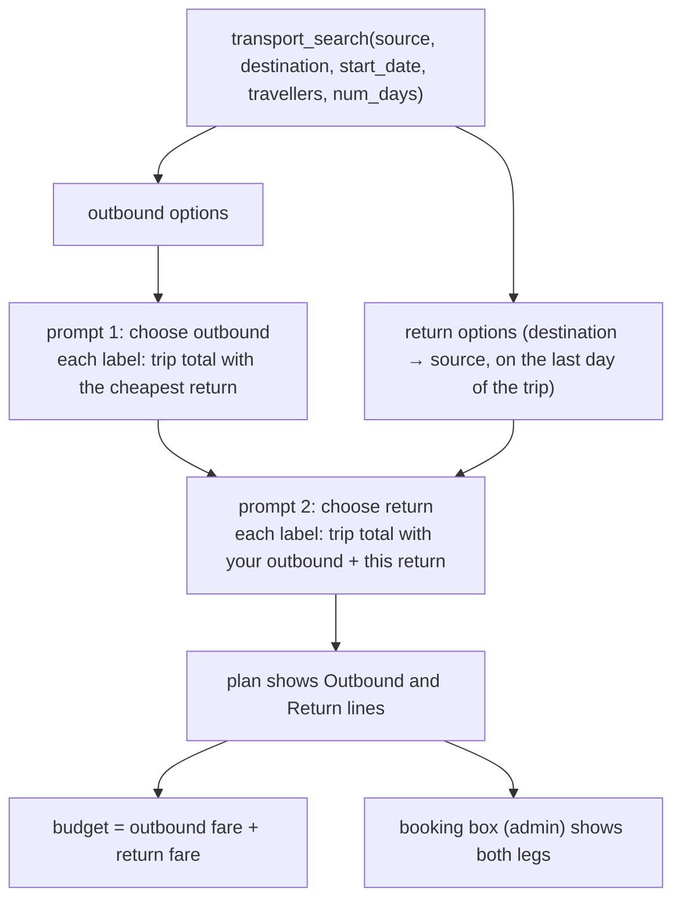

# Transport legs: choosing the way there and the way back

A trip is there and back. The planner shows both legs and lets the user pick each one. The trip total is the
outbound fare plus the chosen return fare.

## What the user sees

1. **Outbound prompt.** Each option shows its own fare and a trip total. The total is priced with the *cheapest*
   return, until the user picks one. The prompt says so.
2. **Return prompt.** Lists the return options (destination → source, on the last day of the trip). Each total uses
   the outbound the user just picked plus that return option.
3. **The plan** prints `Outbound` and `Return … on <date>` lines. The admin booking box shows both legs.

Fares come from a route table or a distance formula. They do not depend on direction or date, so return prices
mirror the outbound ones for now. The return leg still gives a separate choice per leg (flight out, train back),
return-dated booking links, and a correct total when the two legs differ. Real return fares would need the
fare API that is not implemented yet.

## How it works

- **One search call covers both legs.** `transport_search` takes `num_days`. When it is given, the result also has
  `return_options`, `return_route` and `return_date`. The scratchpad keeps one record per tool name, so a second
  call for the reverse route would overwrite the outbound result. The transportation agent still decides to
  search; the tool adds the reverse leg.
- **`num_days` is pinned.** The scratchpad guard (`PINNED` in `scratchpad.ts`) fills it from the saved
  requirements. The date and route are not pinned: a new date or route is the user's own request.
- **Return date** is `start_date + (num_days − 1)` days, the last day of the trip. It matches the budget's
  `nights = num_days − 1`. Code computes it with `addDays`, not the LLM.
- **Budget.** `budget_check` sums `itinerary.transport` and `itinerary.return_transport`. Without a return leg it
  counts the outbound fare `TRIP_LEGS` (2) times, as before. `EstimatedParts.transport` is an amount, because
  only one leg may be a guess (see `price-estimates.md`).
- **Prompts.** `askTransport` in `mainAgent.ts` asks outbound, then return. `choose_transport` and the
  "Switch to a cheaper transport" choice both use it. The switch is recorded in `PlanState`, so a later rebuild
  after a plan edit keeps it.
- **"Adjust places to fit the budget"** takes the cheapest outbound and the cheapest return, with no return prompt.

## Limits

- Return date is fixed at the last day of the trip. To change it, use "change transportation".
- One more prompt on the normal path. The "adjust places" path skips it.
- Not changed: the fare model, the search providers, and how options are sorted.
