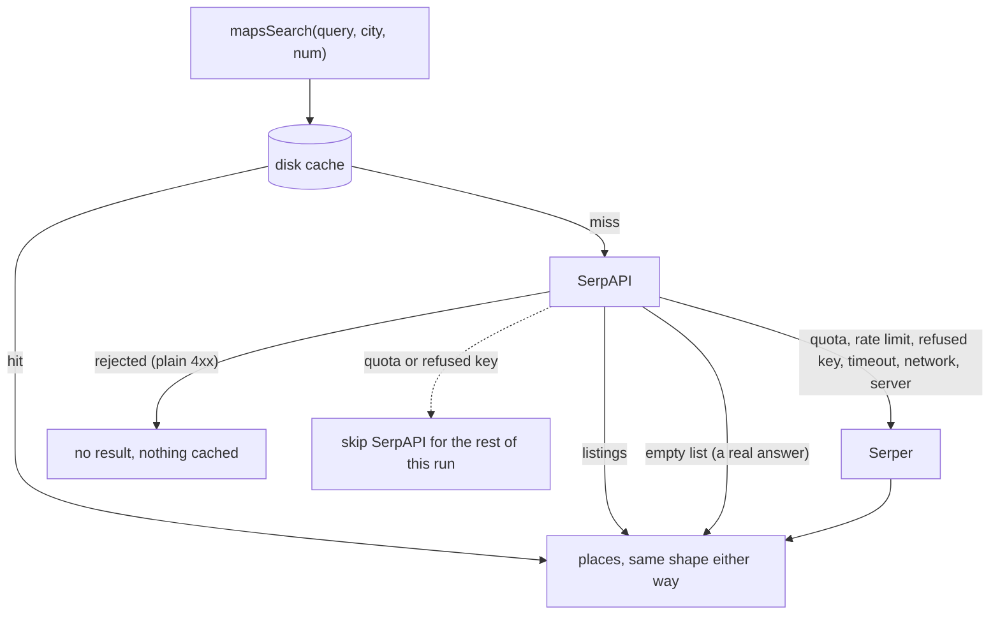
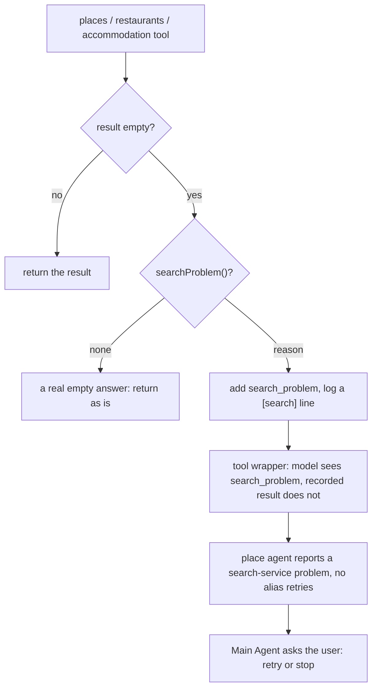
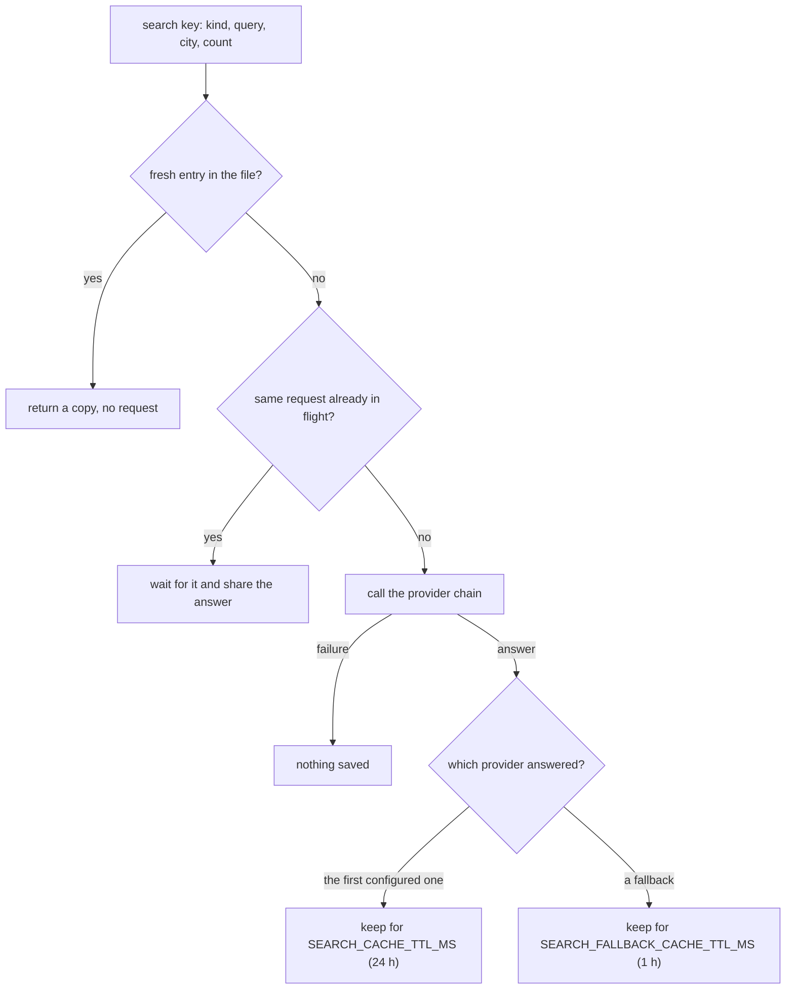

# Search providers and the disk cache

Places, restaurants and hotels come from web-search APIs that have free quotas. This page explains
how a search picks a provider, what happens when one runs out, and how answers are kept between runs.

**The provider does not change the tools' output.** `places_search`, `restaurants_search`,
`accommodation_search` and `transport_search` return the same shape whichever provider answered
(`tests/providers.test.ts` checks the exact keys). Price flags and transport feasibility are a separate change:
see `price-estimates.md`.

## The provider chain

`MAPS_PROVIDER` is an ordered, comma-separated list. The default is `serpapi,serper`. A provider with no
API key is skipped. `mapsSearch()` in `tools/providers/index.ts` tries them in order.

- An empty list is a real answer, so it does **not** send the search to the next provider. Only a failure does.
- A plain 4xx ("rejected") would fail the same way on another provider, so it stops there.
- Code only decides which source to call next. The agents still decide what to search for.

### Why a request failed

`requestJsonDetailed()` in `tools/http.ts` returns `{ body, failure }`. `requestJson()` is a one-line wrapper
that returns only `body`, so weather and geocoding are unchanged.

| `failure` | Meaning | Retried? | Next provider? | Switches the provider off? |
|---|---|---|---|---|
| `quota` | The account is out of searches or credits | no | yes | **yes**, for the rest of the run |
| `unauthorized` | 401/403, the key was refused | no | yes | **yes** |
| `rate_limited` | 429 that is not a quota message | once | yes | no |
| `timeout`, `network`, `server` | Slow, unreachable, or 5xx | once | yes | no |
| `rejected` | Any other 4xx | no | no | no |

Quota is recognised by the message text, because providers reuse 429, 400 and 403 for it. SerpAPI's real
reply when its quota is gone is `429 {"error": "Your account has run out of searches."}`.

### The circuit breaker

The first `quota` or `unauthorized` failure switches that provider off for the rest of the process. A trip makes
12–15 search calls, and without this every one of them would wait on the dead provider. A plain rate limit does
not switch anything off, so one burst cannot disable a provider for the whole run. The calls already in flight
when the first quota error arrives (up to `SEARCH_CONCURRENCY`) still reach the provider.

### When every provider fails

A failed search used to look like "no results": `mapsSearch` returns `[]` when no provider answers, and the tools
passed that on. A place agent seeing three empty lists blamed the destination or the interests, tried other names, and
ended in a clarification loop.

Now each provider call reports its outcome to `noteFailure` (a failure is remembered, a success clears it), and
`searchProblem()` in `providers/shared.ts` answers "why can no search be answered right now?": it names each failing
provider (`serpapi: quota; serper: timeout`), or says none is configured. It returns nothing while at least one
provider can still answer.

`flagOutage` in `mcp_server/handlers.ts` adds `search_problem` only to an empty result. The wrapper in `mcpClient.ts`
shows it to the model and keeps it out of what is recorded, so the itinerary builder never sees an extra key in the
restaurants result. The place agent spec tells the agent to report it and never to invent places; the Main Agent asks
the user whether to retry or stop, and "stop" ends planning (`{"cancelled": true}`).

## What Serper returns (confirmed with real calls)

- `POST https://google.serper.dev/maps`, key in the `X-API-KEY` header, JSON body `{ q, gl, hl, ll }`.
  `ll` (`"@lat,lon,12z"`, the same format SerpAPI uses) is accepted, and the call also works without it.
- Response: `{ searchParameters, ll, places: [...], credits }`.
- Each place has: `position`, `title`, `address`, `latitude`, `longitude`, `rating`, `ratingCount`, `type`,
  `types` (array), `thumbnailUrl`, `cid`, `fid`, `placeId`, and sometimes `website`, `phoneNumber`,
  `description` and `openingHours` (an object of weekday to text).
- **No price fields** on attractions, restaurants or hotels. Every price that comes from Serper is an estimate.
- **`num` is ignored.** A query returns about 20 places (8 for hotels), so the adapter trims the list itself.
- **Each call reports `credits: 3`**, so the disk cache matters more than it does for SerpAPI.
- Bad key: `403 {"message": "Unauthorized.", "statusCode": 403}`. The out-of-credits reply was not observed.
- `shape()` in `tools/maps.ts` already read these names, so Serper's places are passed through unchanged.
  `tests/fixtures/serper_maps.json` is a slice of a real response, so a change in Serper's format breaks a test
  and not a live trip.

Serper's web search (`/search`, 1 credit) is also used to look up a hotel's star class; see `price-estimates.md`.

Hotels have no Serper fallback, because Serper has no hotel-rate endpoint. Real nightly rates come from SerpAPI
`google_hotels`. If that fails, `searchAccommodation` uses a maps listing whose price is an estimate from its rating.

## The disk cache

`tools/cache.ts` keeps answers in `.cache/search.json` (git-ignored). The MCP server is a new process on every
`npm start`, so an in-memory cache was empty on every run and a repeat run paid for the same searches again.

- The key does not include the provider, so a result cached from SerpAPI is reused when Serper would have answered.
- **A fallback's answer is kept for less time.** It has no prices. Without the shorter TTL, a run made while
  SerpAPI is out of quota would keep Serper's price-less answers for a day, even after SerpAPI is topped up.
- "First configured" means the first provider in `MAPS_PROVIDER` that has a key. With no SerpAPI key, Serper is
  the first provider and gets the long TTL.
- A TTL of `0` turns that kind of caching off. Both `0` turns the cache off completely, and the tests rely on that.
- Failures are never saved. Every caller gets its own copy, because tools change the listings they receive.
- The file is written to a temp name and renamed, so a crash cannot leave half a file. If it cannot be written,
  the search still succeeds.
- Delete `.cache/` to clear it. If two processes run at once, the last write wins, which only costs a repeat search.

## Settings

| Variable | Default | Meaning |
|---|---|---|
| `MAPS_PROVIDER` | `serpapi,serper` | Providers to try, in order |
| `SERP_API_KEY`, `SERPER_API_KEY` | empty | A provider with no key is skipped |
| `SEARCH_CONCURRENCY` | `4` | At most this many searches at once, whichever provider |
| `SEARCH_TIMEOUT_MS` | `5000` | Timeout for each search call |
| `SEARCH_CACHE_TTL_MS` | `86400000` (24 h) | Answers from the first provider |
| `SEARCH_FALLBACK_CACHE_TTL_MS` | `3600000` (1 h) | Answers from a fallback provider |
| `SEARCH_CACHE_FILE` | `.cache/search.json` | Where the cache is kept |

## Transport

`transport_search` no longer calls a search API. It used to call SerpAPI for up to four web links, but the ticket
links always came from `buildDeepLinks`. Fares come from the route table or a distance formula (see
`price-estimates.md`). `source` is always `"deep_link_search"` and `organic_search_results` is always `[]`.

## Prices

Serper has no prices, so its places and hotels are estimates. How an estimate is worked out and flagged is in
`price-estimates.md`.
