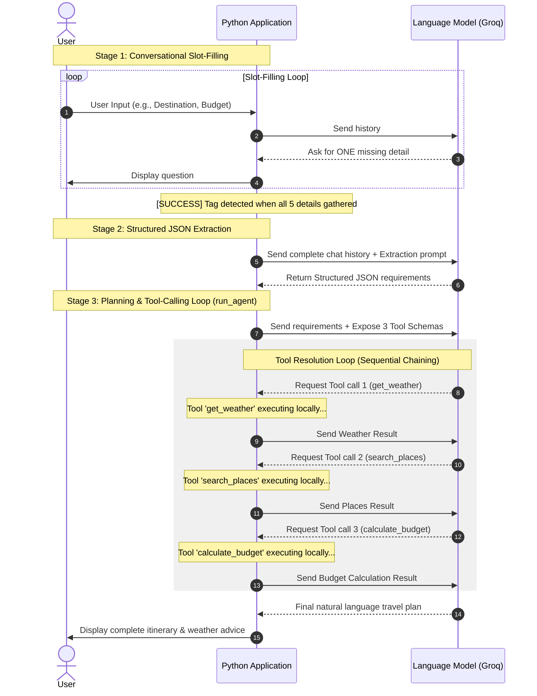

# Multi-Tool Agent Workflow & Architecture

This document outlines the end-to-end architecture and lifecycle of the Multi-Tool Travel Agent, showcasing conversational slot-filling, requirements extraction, and the sequential tool resolution loop.

---

## 🗺️ High-Level Architecture Sequence

---

## 🔄 Detailed Phase-by-Phase Breakdown

### Stage 1: Conversational Slot-Filling
1. **Interactive Loops**: The user interacts with the CLI application. The system instructions mandate that the agent must collect exactly 5 core travel details before writing a plan:
   - *Destination*
   - *Duration*
   - *Budget*
   - *Transportation preferences*
   - *Personal interests*
2. **Deterministic Trigger**: Once the model detects all 5 fields have been provided, it outputs a summary tagged with `[SUCCESS] All details gathered!`. The Python application catches this tag to transition to the next phase.

### Stage 2: Structured JSON Extraction
1. **API Schema Request**: The application copies the message history and appends an extraction instruction instructing the LLM to format the unstructured chat history into a structured schema in JSON Mode (`response_format={"type": "json_object"}`).
2. **Result**: The LLM outputs a clean JSON block parsing variables (e.g., converting `"2 days"` to the integer `2`, separating currency symbols, and extracting an array of interests).

### Stage 3: Planning & Tool-Calling Loop (`run_agent`)
1. **Starting the Planner**: The Python application invokes `run_agent(structured_data, client)` with the structured payload.
2. **Exposing Schemas**: The client passes definitions for three tools:
   - `get_weather(city)`
   - `search_places(city, category)`
   - `calculate_budget(transportation_cost, accommodation_cost, food_cost, activities_cost)`
3. **Sequential Execution**:
   - **Step 1**: The model requests a weather forecast to answer weather-related queries (`get_weather`).
   - **Step 2**: Once the weather is returned, the model requests a places query to retrieve attraction names matching the user's category preference (`search_places`).
   - **Step 3**: Once the places are returned, the model calculates the estimated cost components for the trip to ensure the planned totals align with the user's budget ceiling (`calculate_budget`).
4. **Itinerary Synthesis**: When all details are resolved, the LLM stops issuing tool calls and produces the finalized travel itinerary.
