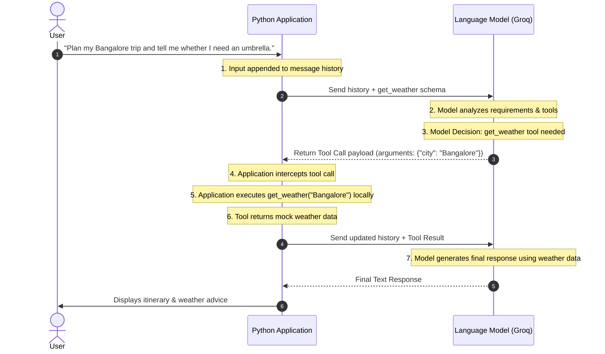

# Simple Tool Calling Workflow

This document explains the lifecycle of a Tool Calling (Function Calling) workflow, using the Travel Agent application as a reference.

---

## 🗺️ High-Level Sequence Diagram



---

## 🔄 Step-by-Step Lifecycle

### 1. User Input & Conversation History
* **User Query**: The user asks a question requiring external information (e.g., *"Plan my Bangalore trip and tell me whether I need an umbrella."*).
* **Application Role**: The Python application appends this query to the chat message logs.

### 2. Sending Request with Tool Schemas
* **Application Role**: The application calls the LLM API. Crucially, it sends both the **message history** and the **tool definition schemas** (like `weather_tool_schema`). The schema tells the LLM what functions exist, what they do, and what parameters they accept.

### 3. Model Decision (Routing)
* **Model Role**: The LLM reads the user request and evaluates it against the available tool schemas. It decides if a tool is required.
* **Result**: It determines that to answer the "umbrella" question, it must obtain weather data for `"Bangalore"` using the `get_weather` tool.

### 4. Tool Call Generation (JSON Response)
* **Model Role**: Instead of outputting standard chat text, the LLM outputs a structured JSON response requesting a tool execution.
* **Payload Structure**:
  ```json
  {
    "tool_calls": [
      {
        "id": "call_abc123",
        "type": "function",
        "function": {
          "name": "get_weather",
          "arguments": "{\"city\": \"Bangalore\"}"
        }
      }
    ]
  }
  ```

### 5. Local Application Execution
* **Application Role**: The Python application intercepts the JSON response, parses the function name (`"get_weather"`) and the arguments (`{"city": "Bangalore"}`), and calls the local Python function: `get_weather(city="Bangalore")`.
* *Note: The LLM does not execute code. The Python script executes the code locally in the application environment.*

### 6. Tool Result Generation
* **Application/Tool Role**: The local Python function executes and returns the raw data payload (e.g., `{"temperature": "25°C", "precipitation_chance": "10%"}`).

### 7. Sending Tool Results Back
* **Application Role**: The Python app wraps the tool's return value in a message with `role: "tool"` and the associated `tool_call_id`. It appends this message to the conversation history and sends it back to the LLM in a second API call.

### 8. Final Model Response Synthesis
* **Model Role**: The LLM reads the entire context (original question + the tool result showing a 10% chance of rain). It synthesizes a final natural language response based on this data (e.g., *"You likely won't need an umbrella since the precipitation chance is only 10%..."*).
* **User Output**: The Python application prints this final response to the user.

---

## ⚔️ How this Differs from a Normal REST API Call

| Feature | Standard REST API Call | LLM Tool Calling (Function Calling) |
| :--- | :--- | :--- |
| **Decision Maker** | **Hardcoded logic.** (e.g., `if "weather" in query: call_api()`) | **The LLM dynamically decides** to call the tool based on semantic understanding. |
| **Parameter Parsing** | **Manual regex / string parsers** written by developers to pull out variables. | **The LLM automatically extracts** and formats arguments into structured JSON. |
| **Execution Site** | **Server-side.** The endpoint runs automatically. | **Client-side.** The LLM only *requests* a run; the local Python application executes the function. |
| **Response Format** | **Rigid structure** mapping to preset front-end templates. | **Natural conversation** woven directly into the response. |
